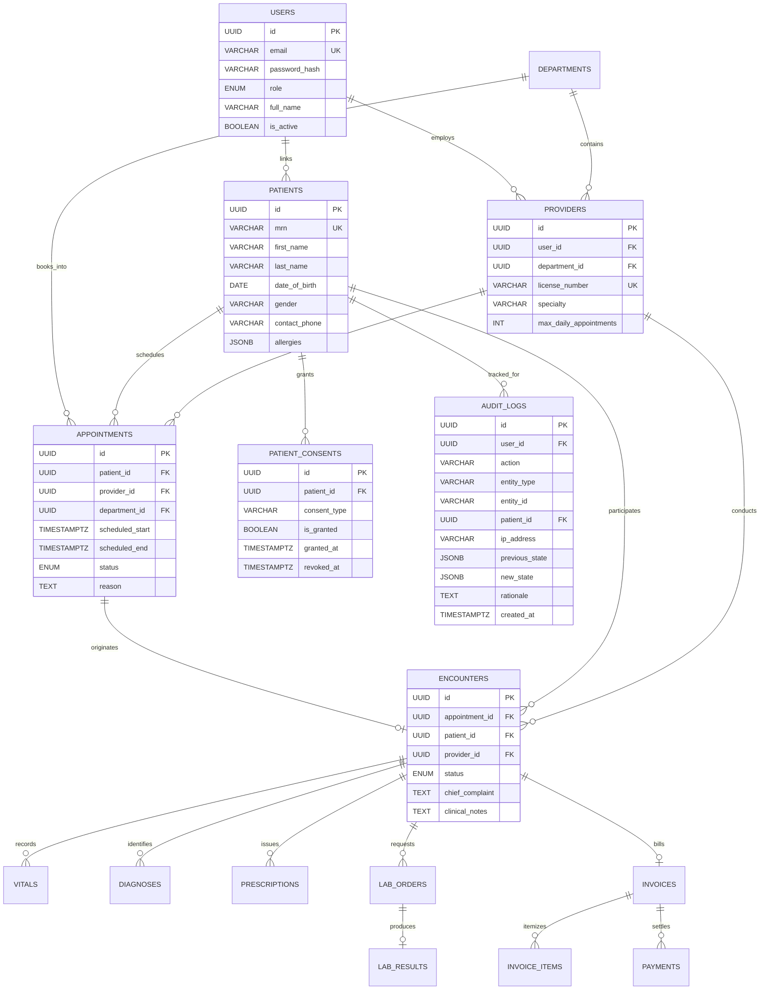

# MediCore Database Entity Relationship Diagram (ERD)
**Assessment 03: Clinical Relational Database**

```mermaid
erDiagram
    USERS ||--o{ PROVIDERS : employs
    USERS ||--o{ PATIENTS : links
    DEPARTMENTS ||--o{ PROVIDERS : contains
    DEPARTMENTS ||--o{ APPOINTMENTS : books_into

    PATIENTS ||--o{ APPOINTMENTS : schedules
    PROVIDERS ||--o{ APPOINTMENTS : attends
    APPOINTMENTS ||--o| ENCOUNTERS : originates

    PATIENTS ||--o{ ENCOUNTERS : participates
    PROVIDERS ||--o{ ENCOUNTERS : conducts

    ENCOUNTERS ||--o{ VITALS : records
    ENCOUNTERS ||--o{ DIAGNOSES : identifies
    ENCOUNTERS ||--o{ PRESCRIPTIONS : issues
    ENCOUNTERS ||--o{ LAB_ORDERS : requests

    LAB_ORDERS ||--o| LAB_RESULTS : produces
    ENCOUNTERS ||--o| INVOICES : bills
    INVOICES ||--o{ INVOICE_ITEMS : itemizes
    INVOICES ||--o{ PAYMENTS : settles

    PATIENTS ||--o{ PATIENT_CONSENTS : grants
    PATIENTS ||--o{ AUDIT_LOGS : tracked_for

    USERS {
        UUID id PK
        VARCHAR email UK
        VARCHAR password_hash
        ENUM role
        VARCHAR full_name
        BOOLEAN is_active
    }

    PATIENTS {
        UUID id PK
        VARCHAR mrn UK
        VARCHAR first_name
        VARCHAR last_name
        DATE date_of_birth
        VARCHAR gender
        VARCHAR contact_phone
        JSONB allergies
    }

    PROVIDERS {
        UUID id PK
        UUID user_id FK
        UUID department_id FK
        VARCHAR license_number UK
        VARCHAR specialty
        INT max_daily_appointments
    }

    APPOINTMENTS {
        UUID id PK
        UUID patient_id FK
        UUID provider_id FK
        UUID department_id FK
        TIMESTAMPTZ scheduled_start
        TIMESTAMPTZ scheduled_end
        ENUM status
        TEXT reason
    }

    ENCOUNTERS {
        UUID id PK
        UUID appointment_id FK
        UUID patient_id FK
        UUID provider_id FK
        ENUM status
        TEXT chief_complaint
        TEXT clinical_notes
    }

    PATIENT_CONSENTS {
        UUID id PK
        UUID patient_id FK
        VARCHAR consent_type
        BOOLEAN is_granted
        TIMESTAMPTZ granted_at
        TIMESTAMPTZ revoked_at
    }

    AUDIT_LOGS {
        UUID id PK
        UUID user_id FK
        VARCHAR action
        VARCHAR entity_type
        VARCHAR entity_id
        UUID patient_id FK
        VARCHAR ip_address
        JSONB previous_state
        JSONB new_state
        TEXT rationale
        TIMESTAMPTZ created_at
    }
```
